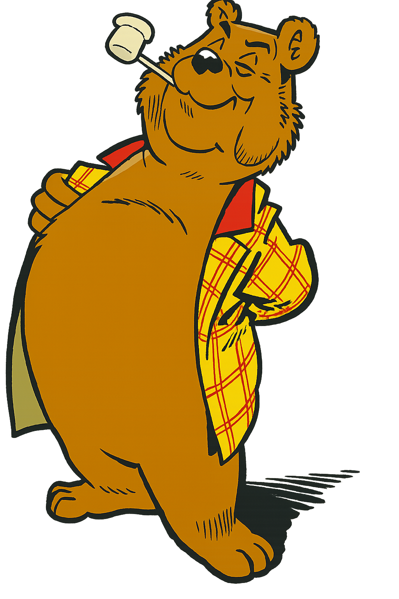

# 📜 Bommel Quotes

Deze route geeft willekeurige uitspraken van Olivier B. Bommel terug. Leuk als knipoog of om je Slackbot wat karakter te geven.
---

<p align="center">
  
</p>

---

## Voorbeeldgebruik:
/quote

---

## Mogelijke quotes:

- "Als je begrijpt wat ik bedoel..."
- "Tom Poes, verzin een list!"
- "Dat is weer een zorg minder."
- "Ik weet het ook allemaal niet meer, jonge vriend..."
- "Daar komt altijd narigheid van!"
- "Dat is niet in overeenstemming met mijn stand."
- "Ik ben een eenvoudig heer, maar..."

---

## 🔧 Uitbreiding

Wil je meer quotes toevoegen?
Je kunt ze eenvoudig:

- **hardcoded toevoegen** in `slack.js`
- **of dynamisch ophalen** uit een Oracle-tabel zoals `KTB_QUOTES`

Voorbeeldcode met random selectie uit lijst:
```js
const quotes = [
  "Als je begrijpt wat ik bedoel...",
  "Tom Poes, verzin een list!",
  "Dat is weer een zorg minder.",
  "Daar komt altijd narigheid van!"
];
const quote = quotes[Math.floor(Math.random() * quotes.length)];
Laat je innerlijke heer spreken… of een handige jonge vriend.

---
